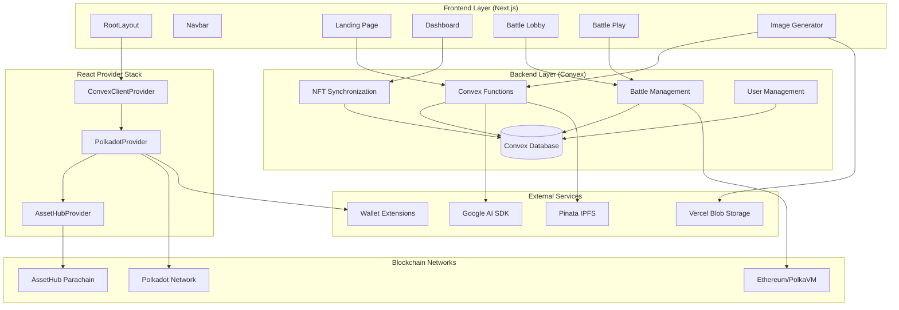

The following diagram illustrates the main architectural components and their relationships within the Vulpix ecosystem:

### High-Level System Architecture

```mermaid
graph TB
    subgraph "Frontend_Layer" ["Frontend Layer (Next.js)"]
        RootLayout["RootLayout"]
        Navbar["Navbar"]
        LandingPage["Landing Page"]
        Dashboard["Dashboard"]
        BattleLobby["Battle Lobby"]
        BattlePlay["Battle Play"]
        ImageGen["Image Generator"]
    end
    
    subgraph "Provider_Stack" ["React Provider Stack"]
        ConvexClientProvider["ConvexClientProvider"]
        PolkadotProvider["PolkadotProvider"] 
        AssetHubProvider["AssetHubProvider"]
    end
    
    subgraph "Backend_Layer" ["Backend Layer (Convex)"]
        ConvexFunctions["Convex Functions"]
        ConvexDB[("Convex Database")]
        BattleLogic["Battle Management"]
        NFTSync["NFT Synchronization"]
        UserMgmt["User Management"]
    end
    
    subgraph "Blockchain_Layer" ["Blockchain Networks"]
        PolkadotNet["Polkadot Network"]
        AssetHub["AssetHub Parachain"]
        EthereumVM["Ethereum/PolkaVM"]
    end
    
    subgraph "External_Services" ["External Services"]
        GoogleAI["Google AI SDK"]
        VercelBlob["Vercel Blob Storage"]
        PinataIPFS["Pinata IPFS"]
        WalletExt["Wallet Extensions"]
    end
    
    RootLayout --> ConvexClientProvider
    ConvexClientProvider --> PolkadotProvider
    PolkadotProvider --> AssetHubProvider
    
    LandingPage --> ConvexFunctions
    Dashboard --> NFTSync
    BattleLobby --> BattleLogic
    BattlePlay --> BattleLogic
    ImageGen --> ConvexFunctions
    
    ConvexFunctions --> ConvexDB
    BattleLogic --> ConvexDB
    NFTSync --> ConvexDB
    UserMgmt --> ConvexDB
    
    PolkadotProvider --> PolkadotNet
    AssetHubProvider --> AssetHub
    BattleLogic --> EthereumVM
    
    ConvexFunctions --> GoogleAI
    ImageGen --> VercelBlob
    ConvexFunctions --> PinataIPFS
    PolkadotProvider --> WalletExt
```