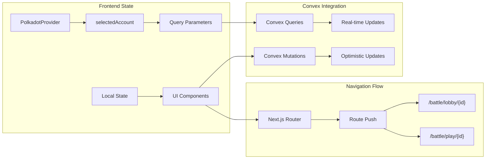

The battle system uses a reactive data architecture with Convex providing real-time updates and optimistic UI patterns.

### Navigation Patterns

The battle system uses predictable URL patterns for different battle states:

| Route Pattern | Purpose | Trigger |
|---------------|---------|---------|
| `/battle` | Main arena hub | Navigation, redirects |
| `/battle/lobby/{lobbyId}` | Lobby preparation | Create/join lobby |
| `/battle/play/{battleId}` | Active battle | Battle start, continue |

Navigation occurs through `router.push()` calls after successful mutations, providing immediate feedback and state transitions.